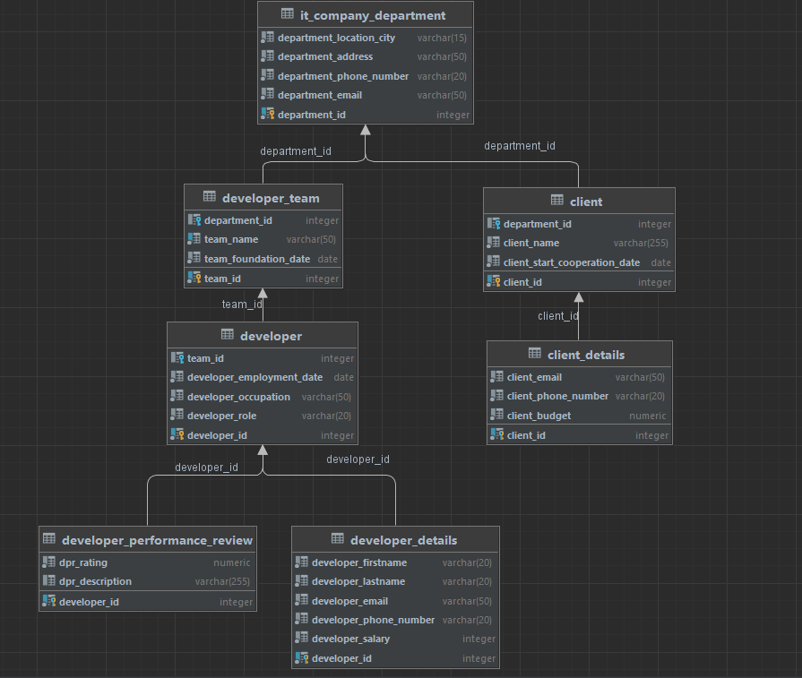

# Сервис IT компании с заказчиками и разработчиками
Сервис позволяет симулировать (в простейшем виде) работу IT компании:

У нашей компании есть отделения, у них есть команды разработчиков, а в команде сами разработчики(зарплата и другие данные)

Также есть заказчики с бюджетом и другими данными

## Стек
1) Java
2) Spring Boot
3) Spring Data JPA
4) Hibernate
5) PostgreSQL
6) Docker и Docker Сompose
7) IntellijIdea (Проект выполнялся в нём)
9) Postman (запросы тестировались в нём)

## Запуск
1) Сделать клон репозитория
2) Перейти в директорию ./src/main/docker
3) 
```docker-compose build```

4) 
```docker-compose up```

5) Тестировать API в **Postman** (!!!)


### Если не получилось запустить docker и docker-compose по каким либо причинам, то:
1) Создать базу данных(PostgreSQL) под именем: test_task_kpfu_dis_main_db
2) Пройти в директорию ./scripts и открыть файл sql.txt
3) В созданной БД в пункте 1, запускаем скрипт из пункта 2 в PgAdmin или в терминале
4) Зайти в application.properties по пути: ./src/main/resources/application.properties
5) Поменять datasource.url если что-то изменили(создали бд под другим именем или порт другой)
6) spring.datasource.url = jdbc:postgresql://localhost:5432/test_task_kpfu_dis_main_db
7) Если другой владелец БД, то меняем datasource.username
8) spring.datasource.username=postgres
9) Если другой пароль от БД, то меняем datasource.url
10) spring.datasource.password=postgres
#### Но должно всё работать :)

### Swagger
По адресу ``` http://localhost:8080/swagger-ui/index.html ```

Так же сделал комментарии в ./src/controller (во всех классах в контроллере)

## Работа Сервиса

Примеры запросов:

1) Получение списка отделений нашей IT компании с возможностью пагинации и сортировки

```  
   *  http://localhost:8080/departments?pageNo=1&pageSize=3&sortBy=departmentEmail
   *  http://localhost:8080/departments?pageNo=1&pageSize=3&sortBy=-departmentEmail
   *  http://localhost:8080/departments?pageNo=1&pageSize=3&sortBy=-departmentId
   *  http://localhost:8080/departments?pageNo=1&pageSize=3&sortBy=departmentId 
```
+ @param sortBy - сортировка по departmentId в возрастающем и
                  в убывающем будет -departmentId
              остальные поля доступные сортировки: departmentLocationCity, departmentAddress,
              departmentPhoneNumber, departmentEmail

2) Получение одного отделения IT компании по id отделения

```
   * http://localhost:8080/department/3
```

3) Получение всех команд у определённого офиса с возможностью пагинации и сортировки

```
     *  http://localhost:8080/department/2/teams?pageNo=1&pageSize=3&sortBy=teamId
     *  http://localhost:8080/department/2/teams?pageNo=1&pageSize=3&sortBy=-teamId
     *  http://localhost:8080/department/2/teams?pageNo=1&pageSize=3&sortBy=-teamName
     *  http://localhost:8080/department/2/teams?pageNo=1&pageSize=3&sortBy=teamFoundationDate
```
+ @param sortBy - сортировка по teamId или teamFoundationDate в возрастающем порядке,
  в убывающем будет -teamId или -teamFoundationDate
  остальные поля доступные сортировки: teamName

4) **Финансовый отчёт для отделения**

   Получение отчёта для определённого отделения по расходам зарплат и доходам от заказчиков

```
    * http://localhost:8080/department/5/report
```

+ Пример ответа JSON: 
```
{
    "departmentId": 5,
    "monthlySalaryExpenses": 1096689,
    "profitFromClients": 23901901
}
```
5) Получение всех списка клиентов у определённого отделения
```
     *  http://localhost:8080/department/2/clients?pageNo=1&pageSize=3&sortBy=clientStartCooperationDate
     *  http://localhost:8080/department/2/clients?pageNo=1&pageSize=3&sortBy=-clientStartCooperationDate
     *  http://localhost:8080/department/2/clients?pageNo=1&pageSize=3&sortBy=clientName
     *  http://localhost:8080/department/2/clients?pageNo=1&pageSize=3&sortBy=-clientId
```
+ @param sortBy - сортировка по clientId или clientStartCooperationDate в возрастающем порядке,
                в убывающем будет -clientId или -clientStartCooperationDate
                остальные поля доступные сортировки: clientName

6) Получение всех команд с возможностью пагинации и сортировки
```
     *  http://localhost:8080/teams?pageNo=3&pageSize=2&sortBy=teamId
     *  http://localhost:8080/teams?pageNo=1&pageSize=1&sortBy=-teamId
     *  http://localhost:8080/teams?pageNo=4&pageSize=10&sortBy=teamFoundationDate
     *  http://localhost:8080/teams?pageNo=2&pageSize=50&sortBy=-teamFoundationDate
```
+ @param sortBy - сортировка по teamId или teamFoundationDate в возрастающем порядке,
                в убывающем будет -teamId или -teamFoundationDate

7) Получение Команды разработчиков по id команды
```
    * http://localhost:8080/team/5
```
8) Получение списка разработчиков определённой команды с возможностью пагинации и сортировки
```
     *  http://localhost:8080/team/4/developers?pageNo=1&pageSize=3&sortBy=developerId
     *  http://localhost:8080/team/4/developers?pageNo=1&pageSize=5&sortBy=-developerId
     *  http://localhost:8080/team/4/developers?pageNo=1&pageSize=1&sortBy=developerEmploymentDate
     *  http://localhost:8080/team/4/developers?pageNo=1&pageSize=3&sortBy=-developerEmploymentDate
```
+ @param sortBy - сортировка по developerId или developerEmploymentDate в возрастающем порядке,
                в убывающем будет -developerId или -developerEmploymentDate

9) Получение разработчика по его id
```
    * http://localhost:8080/developer/7
```

10) Получение всех заказчиков с возможностью пагинации и сортировки
```
     *  http://localhost:8080/clients?pageNo=1&pageSize=3&sortBy=-clientId
     *  http://localhost:8080/clients?pageNo=1&pageSize=3&sortBy=clientId
     *  http://localhost:8080/clients?pageNo=1&pageSize=3&sortBy=-clientStartCooperationDate
     *  http://localhost:8080/clients?pageNo=1&pageSize=3&sortBy=clientStartCooperationDate
```
+ @param sortBy - сортировка по clientId или clientStartCooperationDate в возрастающем порядке,
                в убывающем будет -clientId или -clientStartCooperationDate
                остальные поля доступные сортировки: clientName

11) Получение заказчика по идентификатору заказчика
```
    * http://localhost:8080/client/3
```

## Структура БД
##### Описаны следующие 7 таблиц:
1) it_company_department - Отделения(офисы) нашей IT компании
2) developer_team - У каждого офиса есть несколько команд разработчиков
3) developer - У каждой команды есть разработчики
4) developer_details - Подробные детали определённого разработчика
5) developer_performance_review - Оценка разработчика, которую он получил на Performance Review
   (Performance Review - оценка производительности разработчика + описание как и что ему улучшить)
6) client - Заказчик (У каждого отделения есть свои заказчики)
7) client_details - детали о заказчики(бюджет, телефон, почта и тд.)

# Визуализация Базы Данных




